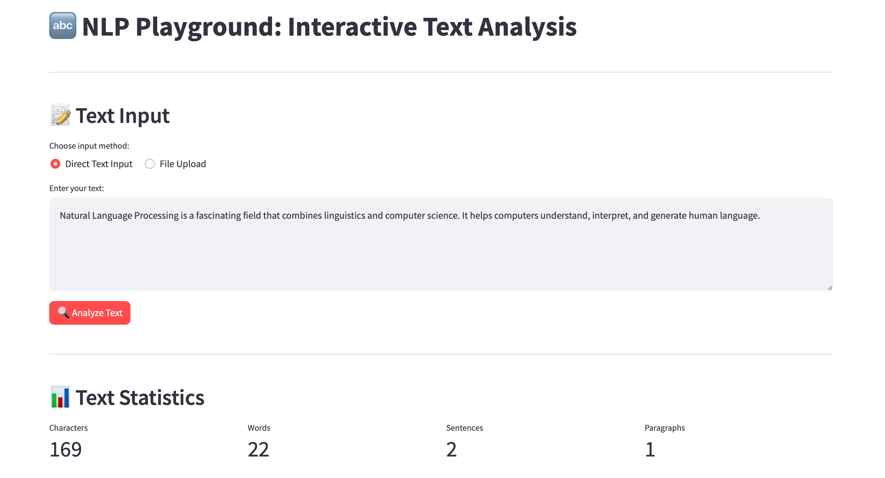

# 🔤 NLP Playground: Interactive Text Analysis

A comprehensive web application for exploring Natural Language Processing concepts through interactive demos and real-time text analysis.


## 🎯 Features

### 📝 **Text Input & File Processing**
- Direct text input with analysis button
- File upload support (TXT, PDF, DOCX)
- Real-time text preview and statistics

### 🔤 **Tokenization & Lemmatization**
- Interactive word tokenization with color-coded highlighting
- Lemmatization visualization with original vs. lemmatized forms
- Token statistics and analysis

### 🏷️ **Named Entity Recognition (NER)**
- Entity highlighting with different colors for each type
- Support for PERSON, ORG, GPE, DATE, TIME, MONEY, and more
- Interactive entity distribution charts
- Detailed entity explanations

### 📚 **Part-of-Speech (POS) Tagging**
- Complete POS tagging with descriptions
- Color-coded text highlighting by grammatical role
- POS distribution visualization
- Interactive tooltips with explanations

### 🌳 **Dependency Parsing**
- Dependency relations analysis
- Visual representation of grammatical dependencies
- Detailed dependency type explanations

### 😊 **Sentiment Analysis**
- Real-time sentiment scoring with interactive gauges
- Polarity and subjectivity measurements
- Sentence-by-sentence sentiment breakdown
- Sentiment trend visualization across text

### 📈 **Word Frequency Analysis**
- Top word frequency charts
- Word cloud data tables
- Statistical text analysis

## 🚀 Quick Start

### Prerequisites

- Python 3.7 or higher
- pip package manager

### Installation

1. **Clone the repository**
   ```bash
   git clone https://github.com/saifDoesCode/NLP-Playground.git
   cd nlp-playground
   ```

2. **Install required packages**
   ```bash
   pip install streamlit spacy textblob nltk pandas plotly python-docx PyPDF2
   ```

3. **Download spaCy English model**
   ```bash
   python -m spacy download en_core_web_sm
   ```

4. **Download NLTK data** (optional - handled automatically)
   ```bash
   python -c "
   import nltk
   nltk.download('punkt_tab')
   nltk.download('punkt')
   nltk.download('wordnet')
   nltk.download('averaged_perceptron_tagger')
   nltk.download('stopwords')
   nltk.download('omw-1.4')
   "
   ```

### Running the Application

```bash
streamlit run app.py
```

The application will open in your browser at `http://localhost:8501`

## 🛠️ Usage

1. **Input Text**: Enter text directly or upload a file (TXT, PDF, DOCX)
2. **Click Analyze**: Press the "🔍 Analyze Text" button to process
3. **Explore Results**: Scroll through different analysis sections:
   - Text Statistics
   - Tokenization & Lemmatization
   - Named Entity Recognition
   - POS Tagging
   - Dependency Parsing
   - Sentiment Analysis
   - Word Frequency Analysis

## 📦 Dependencies

```
streamlit>=1.28.0
spacy>=3.4.0
textblob>=0.17.0
nltk>=3.7
pandas>=1.5.0
plotly>=5.0.0
python-docx>=0.8.11
PyPDF2>=3.0.0
```

## 🏗️ Project Structure

```
nlp-playground/
├── app.py                 # Main Streamlit application
├── requirements.txt       # Python dependencies
├── README.md             # Project documentation
└── assets/               # Screenshots and demo files
    └── demo.png
```

## 🔧 Configuration

The application automatically handles:
- NLTK data downloads with fallback mechanisms
- spaCy model loading with error handling
- File processing for multiple formats
- Robust error handling for missing dependencies

## 🎨 Screenshots

### Main Interface


### Text Analysis Features
- **Tokenization**: Color-coded word and sentence breakdown
- **NER**: Entity highlighting with type classifications
- **POS Tagging**: Grammatical role visualization
- **Sentiment**: Real-time emotion analysis with gauges

## 🤝 Contributing

Contributions are welcome! Here's how you can help:

1. **Fork the repository**
2. **Create a feature branch** (`git checkout -b feature/amazing-feature`)
3. **Commit your changes** (`git commit -m 'Add amazing feature'`)
4. **Push to the branch** (`git push origin feature/amazing-feature`)
5. **Open a Pull Request**

### Development Setup

```bash
# Clone your fork
git clone https://github.com/saifDoesCode/NLP-Playground.git

# Create virtual environment
python -m venv venv
source venv/bin/activate  # On Windows: venv\Scripts\activate

# Install dependencies
pip install -r requirements.txt

# Install development dependencies
pip install black flake8 pytest
```

## 📚 Educational Use

This tool is perfect for:
- **Students** learning NLP concepts
- **Educators** demonstrating text processing techniques
- **Researchers** exploring text analysis methods
- **Developers** prototyping NLP features

## 🐛 Troubleshooting

### Common Issues

**spaCy model not found:**
```bash
python -m spacy download en_core_web_sm
```

**NLTK data missing:**
The app automatically downloads required NLTK data, but you can manually install:
```bash
python -c "import nltk; nltk.download('all')"
```

**File upload errors:**
- Ensure files are in supported formats (TXT, PDF, DOCX)
- Check file size limits (Streamlit default: 200MB)

## 📄 License

This project is licensed under the MIT License - see the [LICENSE](LICENSE) file for details.

## 🙏 Acknowledgments

- **spaCy** - Industrial-strength NLP library
- **NLTK** - Natural Language Toolkit
- **TextBlob** - Simplified text processing
- **Streamlit** - Web app framework
- **Plotly** - Interactive visualizations

---

**⭐ If you find this project helpful, please give it a star!**

Built with ❤️ using Python, Streamlit, and modern NLP libraries.
